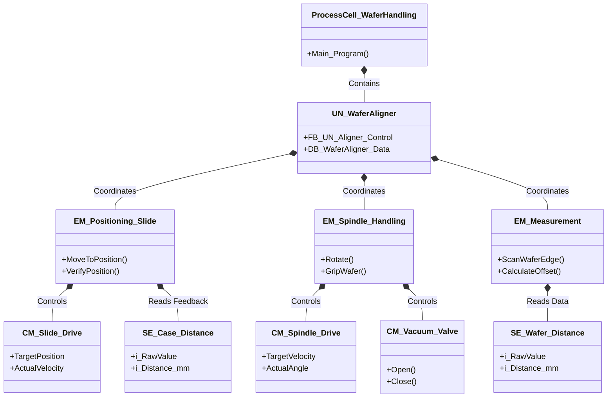

 ``` mermaid 
graph TD
    %% Start en Initialisatie
    Start([Start Commando]) --> Init[UN: Initialiseer Systeem]
    Init --> CheckHome[UN: Controleer of Slide op Home staat]

    %% Positionering
    CheckHome -- Nee --> MoveHome[EM_Positioning: Verplaats naar Startpositie]
    CheckHome -- Ja --> WaitWafer[UN: Wacht op Wafer Present]
    MoveHome --> WaitWafer

    %% Vastpakken en Voorbereiden
    WaitWafer --> VacuumOn[EM_Spindle: Activeer Vacuum Gripper]
    VacuumOn --> CheckVacuum{Vacuum OK?}
    CheckVacuum -- Nee --> Alarm[UN: Alarm - Geen Wafer]
    CheckVacuum -- Ja --> MoveToScan[EM_Positioning: Verplaats Spindle naar Scanpositie]

    %% Meting (Parallelle actie)
    subgraph Meting_Proces [Alignment Scan]
        direction LR
        Rotate[EM_Spindle: Start 360 graden rotatie]
        Measure[EM_Measurement: Scan wafer rand met afstandsensor]
        Rotate <--> Measure
    end

    MoveToScan --> Meting_Proces
    Meting_Proces --> Analyze[EM_Measurement: Bereken Uitlijning]

    %% Afronding
    Analyze --> CheckResult{Binnen Tolerantie?}
    CheckResult -- Nee --> Correct[UN: Bereken Correctiebeweging]
    Correct --> Meting_Proces
    CheckResult -- Ja --> Finish[UN: Alignment Voltooid]
    
    Finish --> MoveExit[EM_Positioning: Verplaats naar Afnamepositie]
    MoveExit --> Release[EM_Spindle: Vacuum Uit]
    Release --> Done([Einde Cyclus])

    %% Styling
    style Start fill:#f9f,stroke:#333,stroke-width:2px
    style Done fill:#f9f,stroke:#333,stroke-width:2px
    style Alarm fill:#ff9999,stroke:#333,stroke-width:2px
    style Meting_Proces fill:#e1f5fe,stroke:#01579b,stroke-dasharray: 5 5
```
# S88
| **Niveau** | **Object in TIA Portal** | **Naam (Voorbeeld)** | **Verantwoordelijkheid**                                                                    |
| ---------- | ------------------------ | -------------------- | ------------------------------------------------------------------------------------------- |
| **Unit**   | **FB (Instance)**        | `UN_WaferAligner`    | De procesregisseur: bepaalt de volgorde (bijv. eerst positioneren, dan draaien, dan meten). |
| **EM**     | **FB (Instance)**        | `EM_Spindle`         | Beheert de rotatie en de vacuüm gripper.                                                    |
| **EM**     | **FB (Instance)**        | `EM_Positioning`     | Beheert de lineaire beweging van de behuizing.                                              |
| **EM**     | **FB (Instance)**        | `EM_Measurement`     | Verwerkt de data van de wafer-afstandssensor om de uitlijning te berekenen.                 |
| **CM**     | **FB / FC**              | `CM_Drive`           | Directe aansturing van de motoren (Snelheid/Positie).                                       |
| **SE**     | **FB / FC**              | `SE_Distance`        | Uitlezen, schalen en bewaken (Min/Max) van de afstandssensoren.                             |
|            |                          |                      |                                                                                             |

## States
| **Getal** | **Status**   | **Type**  | **Betekenis voor de Aligner**                            |
| --------- | ------------ | --------- | -------------------------------------------------------- |
| **2**     | **STOPPED**  | Quiescent | Systeem staat stil, vaak na een fout of noodstop.        |
| **4**     | **IDLE**     | Quiescent | Systeem is klaar en wacht op het `Start` commando.       |
| **6**     | **RUNNING**  | Transient | De machine voert de actie uit (bijv. spindle draait).    |
| **7**     | **STOPPING** | Transient | Bezig met het afbreken van de actie (motoren vertragen). |
| **11**    | **PAUSED**   | Quiescent | De cyclus is tijdelijk onderbroken door de operator.     |
| **17**    | **COMPLETE** | Final     | De uitlijning is succesvol afgerond.                     |
![[Pasted image 20251218110057.png]]

