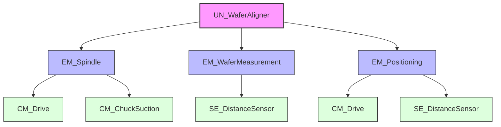

# INDIVIDUAL ASSIGNMENT REQUIREMENTS
--- 

## UNIT SCOPE & REQUIREMENTS

### 3.1 Unit Definition and Role
The **Wafer Aligner Unit** is a critical process station within the larger semiconductor handling system. Its primary role is to ensure that wafers, which are placed with random orientation and potential eccentricity by the transport robot, are mechanically re-oriented to a precise "Notch/Flat" position and centered. This is a prerequisite for subsequent lithography or inspection steps where alignment is mandatory.

The unit operates as a "Turn-Table" station integrating precise rotary motion control, vacuum physics for wafer holding, and optical sensing for edge detection.

### 3.2 Unit Decomposition (ISA-88)
To manage the complexity of the alignment process, the unit is decomposed according to the ISA-88 standard into Equipment Modules (EM) and Control Modules (CM). This modular architecture ensures separation of concerns between motion, sensing, and global coordination.

*   **UN_WaferAligner:** The main unit supervisor implementing the core state machine (IDLE, CLAMP, SCAN, CALC, POSITION, RELEASE).
*   **EM_Spindle:** Manages the rotary motion of the chuck, handling velocity and acceleration dynamics. This module contains `CM_Drive` (Motor) and `CM_ChuckSuction` (Vacuum).
*   **EM_WaferMeasurement:** Handles the optical scanning process using `SE_DistanceSensor` to record wafer edge positions.
*   **EM_Positioning:** Responsible for calculating corrective moves and managing sensor rail positioning (if applicable for multi-size wafers).

### 3.3 Unit Interfaces and Interactions
The unit interacts with the external world primarily through the System Controller (Robot) and the physics simulation environment.

| Interface Type | Signal/Variable | Direction | Description |
| :--- | :--- | :--- | :--- |
| **Control (SEMI E84)** | `TR_REQ` | Input | Robot requests to load a wafer. |
| | `READY_TO_LOAD` | Output | Aligner is empty and ready. |
| | `BUSY` | Output | Process active (Clamp/Scan/Align). |
| | `PROCESS_COMPLETE` | Output | Alignment finished, ready for pickup. |
| **Physics (FMU)** | `M_Wafer` | Parameter | Mass of the wafer (kg). |
| | `P_Vacuum` | Input | Vacuum pressure applied (Pa). |
| | `Alpha_Motor` | Input | Angular acceleration ($rad/s^2$). |
| | `Slip_Factor` | Output | Calculated slip risk (>1.0 = fail). |

### 3.4 Unit Functional Requirements (Derived)
The following requirements are derived from the system-level objectives (Throughput, Stability, Cleanliness) and are specific to the Wafer Aligner Unit.

| ID | Category | Requirement Description | Test Criteria |
| :--- | :--- | :--- | :--- |
| **UR-01** | Operation | The unit must secure the wafer using vacuum pressure before any motion begins. | `CM_ChuckSuction` active status is TRUE before `EM_Spindle` moves. |
| **UR-02** | Sensing | The unit must perform a $360^{\circ}$ scan to map the wafer edge profile. | Sensor array captures 360+ data points during rotation. |
| **UR-03** | Algorithm | The system must calculate the angular offset of the Notch from the edge profile data. | Calculated Angle matches introduced offset $\pm 0.5^{\circ}$. |
| **UR-04** | Motion | The spindle must rotate the wafer to the target alignment angle via the shortest path. | Final position matches target; Motion time < 2s. |
| **UR-05** | Safety | The unit must detect potential wafer slip using the integrated FMU model. | If `Slip_Factor` > 1.0, system enters Error state. |
| **UR-06** | Interface | The unit must adhere to the SEMI E84 Handshake protocol for loading/unloading. | Sequence: REQ $\to$ READY $\to$ BUSY $\to$ COMPLETE. | 

## NX DIGITAL TWIN DEVELOPMENT
---

## CONTROL/AUTOMATION CODE
---

## UNIT TESTING & VERIFICATION
---

# FMU DEVELOPMENT
--- 

## TECHNICAL BACKGROUND
---

##  FMU IMPLEMENTATION & STAND -ALONE TESTING
---

## FMU INTEGRATION & PORTABILITY
---