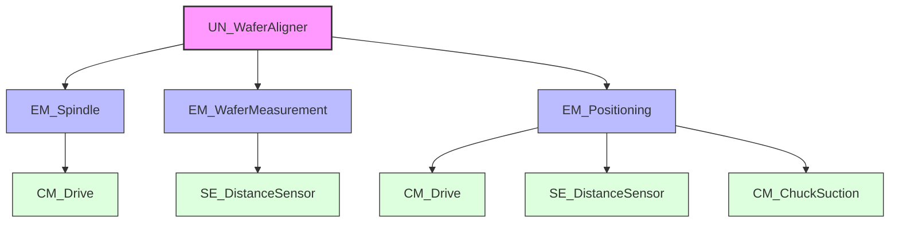
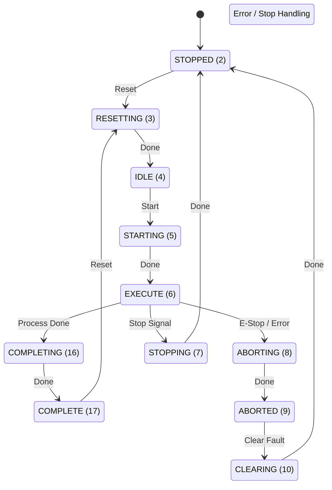
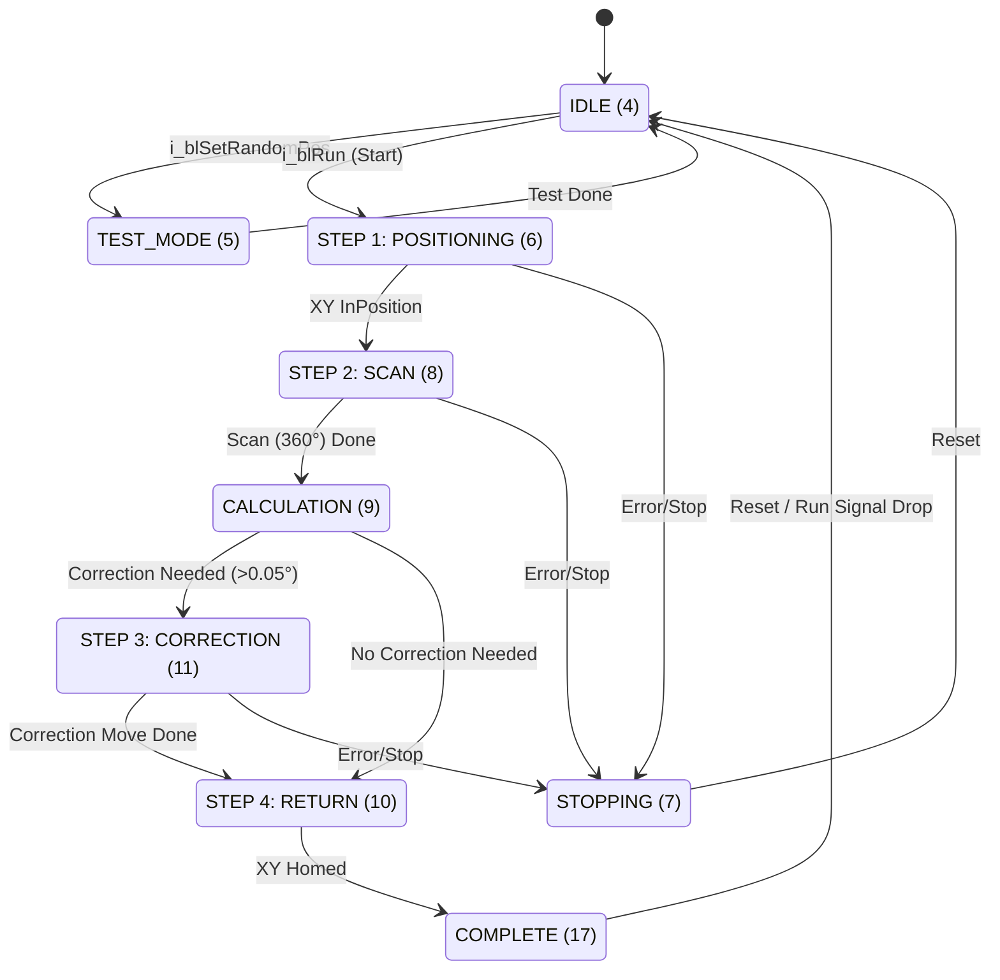
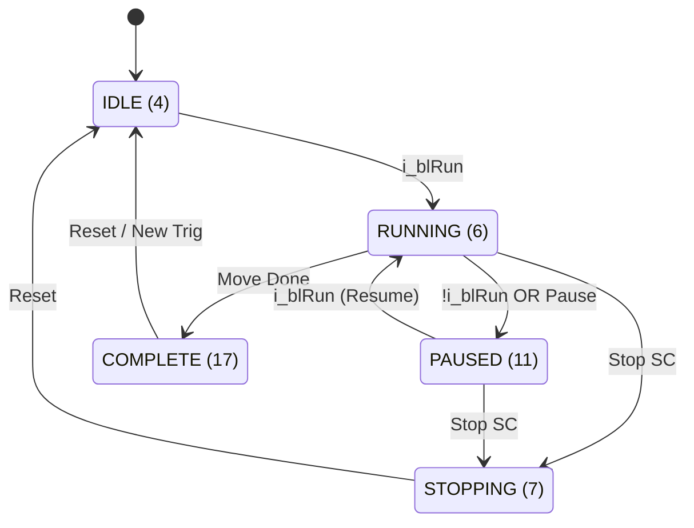
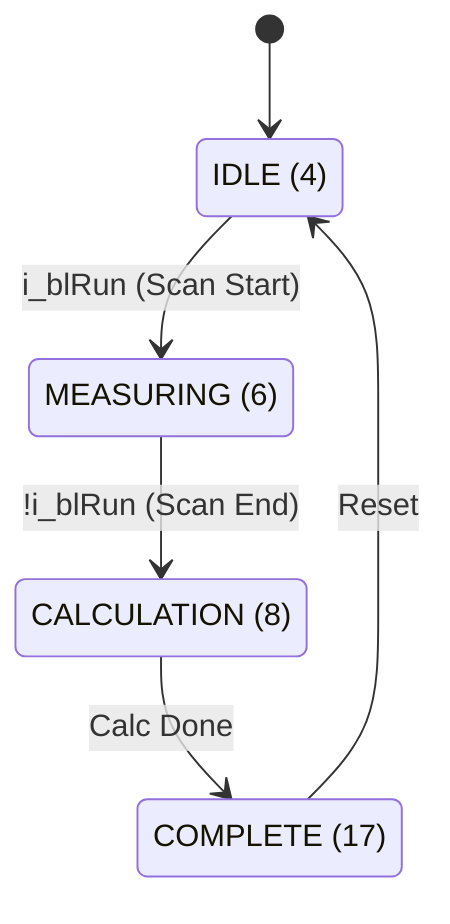
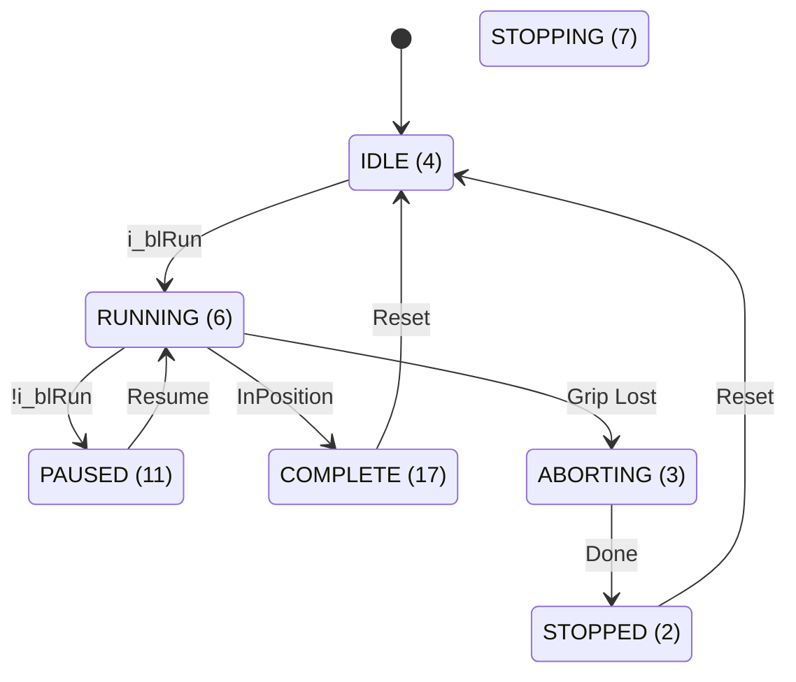

# Individual Assignment Requirements
--- 

## Unit Scope & Requirements
---

### Unit Definition and Role
The **Wafer Aligner Unit** is a process station within the larger semiconductor handling system. Its primary role is to ensure that wafers, which are placed with random orientation and potential eccentricity by the transport robot, are mechanically re-oriented to a precise "Notch/Flat" position and centered. This is a prerequisite for subsequent lithography or inspection steps where alignment is mandatory.

The unit operates as a "Turn-Table" station integrating precise rotary motion control, vacuum physics for wafer holding, and optical sensing for edge detection.

### Unit Functional Requirements
The following requirements are derived from the system-level objectives (Throughput, Stability, Cleanliness) and are specific to the Wafer Aligner Unit.

| ID        | Category  | Requirement Description                                                               |
| :-------- | :-------- | :------------------------------------------------------------------------------------ |
| **UR-01** | Operation | The unit must secure the wafer using vacuum pressure before any motion begins.        |
| **UR-02** | Sensing   | The unit must perform a $360^{\circ}$ scan to map the wafer edge profile.             |
| **UR-03** | Algorithm | The system must calculate the angular offset of the Notch from the edge profile data. |
| **UR-04** | Motion    | The spindle must rotate the wafer to the target alignment angle.                      |
| **UR-05** | Safety    | The unit must detect potential wafer slip using the integrated FMU model.             |
| **UR-06** | Interface | The unit must adhere to the SEMI E84 Handshake protocol for loading/unloading.        |

### Unit Decomposition (ISA-88)
To manage the complexity of the alignment process, the unit is decomposed according to the ISA-88 standard into Equipment Modules (EM) and Control Modules (CM). This modular architecture ensures separation of concerns between motion, sensing, and global coordination.



*   **UN_WaferAligner:** The main unit supervisor implementing the core state machine (IDLE, CLAMP, SCAN, CALC, POSITION, RELEASE).
*   **EM_Spindle:** Manages the rotary motion of the chuck, handling velocity and acceleration dynamics. This module contains `CM_Drive` (Motor).
*   **EM_WaferMeasurement:** Handles the optical scanning process using `SE_DistanceSensor` to record wafer edge positions.
*   **EM_Positioning:** Responsible for calculating corrective moves and managing sensor rail positioning (for multi-size wafers).

## Nx Digital Twin Development
---

### Modelling Approach in Siemens NX
The Digital Twin for the Wafer Aligner was developed using Siemens NX Mechatronics Concept Designer (MCD). The approach involved importing the static 3D CAD assembly and enriching it with physical properties, kinematic constraints, and signal interfaces to create a real-time behavioral model. The hierarchy in the **Physics Navigator** strictly follows the mechanical assembly structure to ensure traceability.

### Rigid Bodies & Mass Properties
Rigid Bodies were assigned to all moving components to define their mass and inertia. A critical aspect of this unit is the accurate simulation of the wafer's inertial forces to validate the slip detection FMU.

*   **RB_Wafer_200mm:**
    *   **Material:** **Silicon** was applied with a density of **2330 kg/m³** (2.33 g/cm³).
    *   **Justification:** Accurate mass is essential for calculating the centrifugal forces acting against the vacuum grip during rotation.
*   **RB_CHUCK:**
    *   **Material:** **Aluminium_6061**.
    *   **Justification:** Provides the correct rotational inertia for the motor drive simulation.
*   **RB_ALIGNERCASE:** Defined as a Fixed Rigid Body to serve as the ground reference.
*   **RB_SPINDLE / RB_SPINDLECASE:** Assigned calculated masses to simulate load on the linear and rotary drives.

**(Place screenshot of Rigid Body properties/Navigator here)**

### Joints & Kinematic Chains
The kinematic chain is constructed to allow both linear positioning (for different wafer sizes) and rotary alignment (for notch detection).

*   **RB_ALIGNERCASE_FJ (Fixed Joint):** Anchors the Aligner Case to the global coordinate system.
*   **RB_SPINDLECASE_RB_ALIGNERCASE_SJ (Sliding Joint):**
    *   **Type:** Sliding Joint (Z-Axis).
    *   **Function:** Allows the Spindle construction to move linearly to position the wafer edge under the sensor.
    *   **Limits:** Hard stops defined at 0mm and 200mm to prevent over-travel.
*   **RB_SPINDLE_RB_SPINDLECASE_HJ (Hinge Joint):**
    *   **Type:** Hinge Joint (Z-Axis).
    *   **Function:** Enables the infinite rotation of the spindle.
*   **RB_CHUCK_RB_SPINDLE_FJ (Fixed Joint):** Locks the Chuck to the Spindle shaft, ensuring they rotate as a single unit.

**(Place screenshot of Joint Navigator structure here)**

### Collision Bodies & Contact Settings
Collision bodies are defined to manage physical interactions. A specific friction model was implemented to facilitate the FMU slip simulation.

*   **Collision Definitions:**
    *   `CB_Wafer`: Composite collision body covering the wafer surface and notch geometry.
    *   `CB_Chuck`: Cylindrical collision body for the table surface.
*   **Contact Material & Friction:**
    *   A custom collision material interaction was created between the **Wafer** and the **Chuck**.
    *   **Friction Coefficient:** **0.6** (Dynamic/Static).
    *   **Purpose:** This friction value, combined with the simulated vacuum force, defines the "Slip Limit" for the FMU. If inertial forces exceed $F_N \times 0.6$ (where $0.6$ is the friction coefficient), the wafer is allowed to slide in the simulation.

### Sensors, Actuators & Runtime Constraints
To interface with the PLC (TIA Portal), actuators and sensors are mapped to "Position Controls" and "Distance Sensors".

*   **Position Controls:**
    *   `RB_SPINDLE...PC`: Controls velocity and position of the rotary axis.
    *   `RB_SPINDLECASE...PC`: Controls the linear axis.
*   **Sensors:**
    *   `Wafer_DistanceSensor`: An optical ray-cast sensor simulating the edge measurement micrometer.
    *   `Spindle_Case_DistanceSensor`: Feedback for the linear slide position.
*   **Runtime Behaviors:**
    *   `RB_Chuck_SC`: A custom signal adapter that toggles the "Active" state of the friction joint based on the PLC Vacuum command.

### Simplifications & Justifications
*   **Rigid Body Assumption:** All parts are modelled as rigid bodies. Structural deformation (flexing) is ignored as it has negligible impact on the low-speed alignment process and complicates the real-time simulation unnecessarily.
*   **Vacuum Simplification:** The complex fluid dynamics of the vacuum suction are simplified into a binary "stick/slip" friction state modification, which is sufficient for checking kinematic safety.

## Control/Automation Code
---
### Control Architecture Overview
The control logic for the Wafer Aligner Unit is structured according to the **ISA-88 physical hierarchy**, ensuring modularity, scalability, and ease of maintenance. This structure creates a clear separation of concerns:
*   **Unit Module (UN):** The high-level supervisor containing the Process State Machine. It coordinates the sequence of operations but does not directly control hardware.
*   **Equipment Modules (EM):** Functional subsystems (e.g., Spindle, Positioning) that encapsulate specific capabilities. They execute commands from the Unit (e.g., "Go to Position") and handle the internal complexity of how to achieve that.
*   **Control Modules (CM):** The lowest level of logic that interfaces directly with physical actuators and sensors (e.g., Motor Drives, Valves).

### Used Standards
To maintain high code quality and interoperability, the solution strictly adheres to the following standards:

#### Standardized State Model (PackML)
The system adopts the **PackML (ISA-TR88)** standard for state management. This ensures consistent behavior across all units (Unit, Equipment, and Control Modules). While the specific internal logic varies, the high-level states remain consistent and identifiable by their standard integer status codes.

**Default PackML State Machine:**


#### Data Types & Naming (Hungarian Notation)
**Internal Data Handling (LV Tags):**
To ensure strict encapsulation, the architecture distinguishes between public interfaces and private logic. **Local Variables** (prefixed with `#LV` in the code) are used exclusively for internal state management. These variables follow **Hungarian Notation** to strictly define data types:
*   `bl`: **Boolean** (e.g., `#LVblRun` - Digital flag)
*   `di`: **Double Integer** (e.g., `#LVdiState` - Counters/Modes)
*   `rl`: **Real** (e.g., `#LVrlVelocity` - Floating point values)

This practice prevents external modules from accessing internal logic and allows developers to instantly recognize variable types, reducing assignment errors.

#### User Defined Types (UDTs)
To ensure clean interfaces and prevent "spaghetti code", communication between blocks is done exclusively via **User Defined Types (UDTs)**. Each module exposes a standard set of structures:
*   **Input:** Commands and parameters from superior blocks (e.g., `i_blRun`, `i_rlTarget`).
*   **Output:** Status and feedback to superior blocks (e.g., `q_blDone`, `q_rlActualPos`).
*   **Config:** Static configuration parameters (e.g., `c_rlMaxVelocity`).
*   **Status:** Internal state information (e.g., `s_diStatus`).

This standardization ensures that every module interaction is predictable and type-safe.

#### Documentation Standards
To ensure maintainability, the code includes explicit comments for every state transition and significant logic block. This allows future developers to understand the "why" behind the logic, not just the "how".

### UN_WaferAligner (Unit Supervisor)
The `UN_WaferAligner` block is the brain of the operation. It implements a sequential state machine that orchestrates the alignment process. It does not perform complex motion calculations itself; instead, it delegates tasks to the Equipment Modules.

#### State Machine Logic
The unit operates on a defined state model rooted in standard PackML states (Idle, Execute, Complete, Stopped).



#### Code Implementation (Structure)
The logic is implemented in **SCL (Structured Control Language)** using a `CASE` statement for clear state transition management. The code makes extensive use of User Defined Types (UDTs) for clean interfaces (`#ioUnit`).

**Excerpt from `UN_WaferAligner.scl`:**
``` SCL
CASE #ioUnit.Status.s_diStatus OF
    4: // IDLE
        #LVblRunPos := FALSE; // Reset commands
        IF #ioUnit.Input.i_blRun THEN
            #ioUnit.Status.s_diStatus := 6; // Transition to Step 1
        END_IF;

    6: // STEP 1: Position Wafer (Move X-Axis)
        #LVblRunPos := TRUE;
        // Wait for Equipment Module feedback
        IF #ioUnit.emPositioning.Output.q_blInPosition THEN
            #ioUnit.Status.s_diStatus := 8; // Transition to Step 2
        END_IF;
        
    8: // STEP 2: Spindle Action (Rotate 360)
         #LVblRunSpindle := TRUE;
         #ioUnit.emSpindle.Config.c_rlVelocity := 3.6; // Slow scan speed
         // ...
```

### Equipment Modules
Equipment Modules act as intelligent agents. They receive high-level commands (e.g., Target Velocity, Target Position) and manage the underlying physics and control loops.

#### EM_Spindle
This module manages the rotary axis. It handles the translation of the Unit's request ("Rotate 360 degrees" or "Correct by 12 degrees") into precise drive commands.
*   **Modes:** Supports both Automatic (Sequence, `s_diOpMode=0`) and Manual (HMI, `s_diOpMode=1`) modes.
*   **Sequential Logic:** It tracks a normalized 0-360° position relative to the starting point of the measure cycle (`#LVrlNormalizedPos`), ensuring the correction move is accurate regardless of current motor alignment.



#### EM_WaferMeasurement
This module encapsulates the sensing logic. Instead of the Unit checking the raw sensor value every cycle, this module monitors the `SE_DistanceSensor` during the scan phase and calculates the required result.
*   **Notch Detection Logic:**
    The algorithm identifies the wafer notch by monitoring the deviation (`Delta`) between current distance and nominal radius.
    1.  **Threshold Check:** If `Delta > c_rlNotchThreshold` (typically 0.9mm), the state `#LVblInNotchRegion` becomes TRUE.
    2.  **Data Accumulation:** While in the notch region, the system accumulates the angle of every sample (`#LVrlNotchAngleSum`) and counts samples (`#LVdiNotchSampleCount`). It also tracks the maximum depth for diagnostics.
    3.  **Center Calculation (Exit Edge):** When the sensor signal drops back below the threshold, the system triggers the calculation. The center of the notch is derived by averaging all accumulated angles:
        $$ \theta_{center} = \frac{\sum \theta_{samples}}{N_{samples}} $$
        This statistical approach is more robust against sensor noise than simply taking the midpoint of start/end angles or the single deepest point.
*   **Interface:** Returns `q_blNotchFound` and corrected flow values (`q_rlRotationCorrection`, `q_rlEccentricity`).



#### EM_Positioning
Controls the linear positioning of the wafer (load/unload) across three standard sizes (150mm, 200mm, 300mm). It abstracts the complexity of two separate drives (`CM_Drive` for Main Axis, `CM_Drive` for Sensor Axis) into a single "Positioning" interface for the Unit.
*   **Flexible Configuration:** Uses config tags (`c_rlPos1` to `c_rlPos3`) to define standard loading positions.
*   **Verification:** It includes a "Grip Check" logic in the **RUNNING (6)** state. Use `#LVblGrip := TRUE;` to ensure vacuum integrity before moving.
*   **Homing:** Includes a specific homing routine that validates position against `#LVrlHomePosSensor` (141.975mm).




## Unit Testing & Verification
---

# Fmu Development
--- 

## Technical Background
The **Functional Mock-up Interface (FMI)** is a tool-independent standard that facilitates the exchange of dynamic models and co-simulation. It allows the creation of a **Functional Mock-up Unit (FMU)**, which is a compressed file (ZIP format) containing:
*   **modelDescription.xml**: An XML file defining the model's structure, variables (inputs, outputs, parameters), and capabilities.
*   **Binaries**: Compiled libraries (DLL for Windows, .so for Linux) containing the model's executable code.
*   **Resources**: Auxiliary files such as data tables or documentation.

There are two main FMI protocols:
1.  **Model Exchange (ME):** The FMU provides the dynamic equations, but the solver (numerical integrator) is provided by the importing tool. This requires tight coupling.
2.  **Co-Simulation (CS):** The FMU contains its own solver and time-stepping mechanism. The importing tool synchronizes data at discrete communication points.

**Project Choice:**
For this project, **FMI 2.0 for Co-Simulation** was selected. The wafer slip dynamics model represents a self-contained physics domain (friction mechanics) that can run independently of the main machine control loop, making Co-Simulation the robust choice for integration with Siemens NX or PLCSim Advanced.

## Fmu Implementation & Stand-Alone Testing

### Implementation Details
The FMU implements a **Wafer Slip Dynamics** model to enhance the Digital Twin's fidelity. While the standard kinematic model in NX MCD often assumes perfect friction, this FMU simulates physical constraints where aggressive acceleration can cause the wafer to detach.

**Tools Used:**
*   **Language:** Modelica (chosen for its native support of physical systems and equation-based modeling).
*   **Environment:** OpenModelica (used to develop the model and export it as an FMI 2.0 compliant container).

**Physics Model (Slip Logic):**
The model calculates a dimensionless **Slip Factor** based on the ratio between the inertial forces caused by acceleration and the friction forces provided by the vacuum chuck.

$$ F_{inertial} = m_{wafer} \cdot r_{wafer} \cdot \alpha $$
$$ F_{friction} = \mu \cdot (P_{vac} \cdot A_{chuck}) $$

The critical condition is defined as:
$$ SlipFactor = \frac{F_{inertial}}{F_{friction}} $$

*   **Inputs:** Angular Acceleration ($\alpha$), Vacuum Active (Boolean), Wafer Type (Int).
*   **Outputs:** Slip Factor (Real), Max Safe Acceleration (Real), Is Slipping (Boolean Alarm).
*   **Parameters:** Coefficient of Friction ($\mu=0.6$), Nominal Vacuum Pressure ($53 kPa$).

### Stand-Alone Testing
Before integration, the FMU was validated using a stand-alone Python script (`test_fmu.py`) utilizing the `fmpy` library, which acts as an FMI-compliant master to load and step through the simulation.

**Test Scenarios & Results:**
1.  **Safe Operation:** 200mm wafer, Vacuum ON, Low Acceleration (5 rad/s²).  
    *Result:* Slip Factor < 1.0 (Pass).
2.  **Aggressive Acceleration:** 200mm wafer, Vacuum ON, Extreme Acceleration (>100k rad/s²).  
    *Result:* Slip Factor > 1.0, Alarm Triggered (Pass).
3.  **Vacuum Loss:** Vacuum OFF.  
    *Result:* Immediate Slip detected (Pass).

Characteristic curves were generated to verify the linear relationship between acceleration and slip risk, ensuring the physics model behaves predictably.
![[test_scenarios_results.png]]
![[vacuum_characteristic.png]]
![[slip_risk_contour.png]]
![[slip_characteristic.png]]
## Fmu Integration & Portability

### Integration Strategy
The FMU is designed to interface with the **Unit Supervisor (UN_WaferAligner)** logic.
1.  **Signal Mapping:** The PLC calculates angular acceleration (derivative of the Spindle velocity) and passes it to the FMU via OPC UA or PLCSim Advanced API.
2.  **Feedback Loop:** The FMU continuously calculates the `Slip Factor`.
3.  **Safety Interlock:** If the FMU output `Is Slipping` becomes TRUE, the PLC logic triggers an immediate **Soft Stop** and raises a "Vacuum Grip Lost" alarm. This adds a layer of physical realism that pure kinematic code cannot provide.

### Portability Demonstration
To satisfy the FMI 2.0 mandatory requirement for portability, the compiled FMU (`WaferSlipDynamics.fmu`) was tested in an external environment distinct from its development source.

**External Environment:** `FMPy` (FMI Validation Tool)
The successful execution of the test suite proves that the FMU is not just a Python script, but a widely compatible binary package. It was successfully loaded, initialized, and stepped through by the `FMPy` engine, confirming that it can be exported to other industry-standard tools like **OpenModelica**, **MATLAB/Simulink**, or **Siemens NX**.