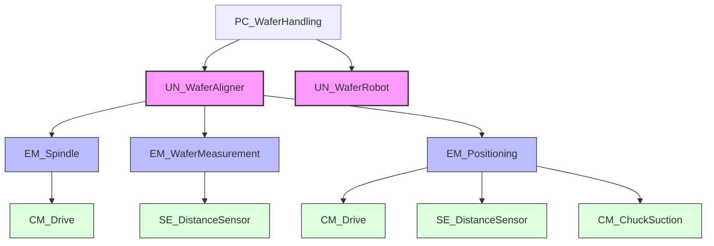
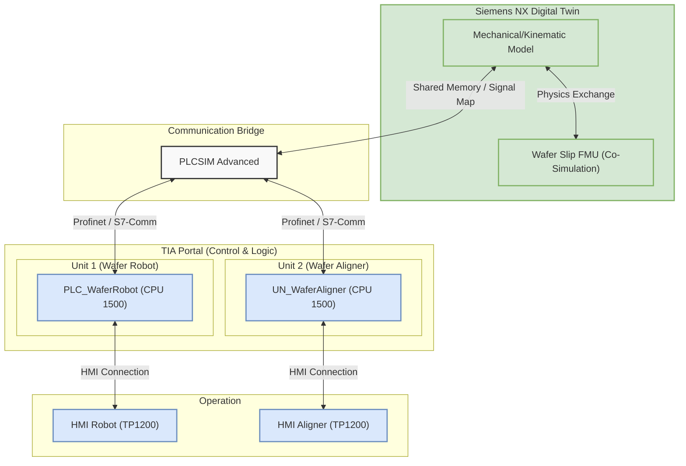
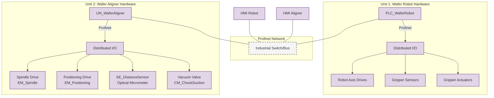
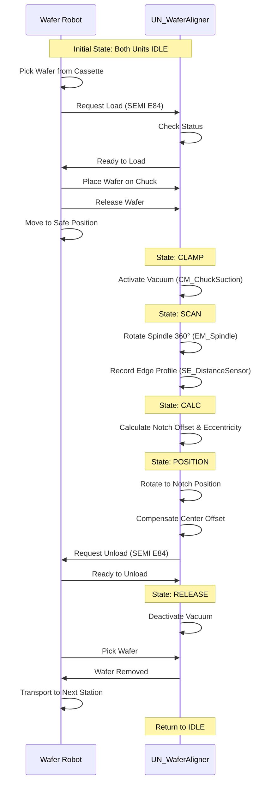

# Introduction
---
## Context and Objectives
This report documents the development of a comprehensive **Digital Twin** for a high-precision **Wafer Handling System**, a critical subsystem in semiconductor manufacturing. Undertaken as a 7-week collaborative project, the primary objective was to conceptualize, design, and implement a fully functional virtual prototype that integrates mechanical kinematics, industrial automation logic, and multi-physics simulation.

The project simulates a collaborative cell interacting with 200mm silicon wafers. The core pedagogical goal is to master the interoperability between domain-specific engineering tools, specifically bridging the gap between mechanical design (CAD/MCD), control engineering (PLC/HMI), and physics simulation (FMU).

## Toolchain and Technologies
To achieve a high-fidelity Digital Twin, the following industry-standard software suite was employed:

*   **Siemens NX 2312 (Mechatronics Concept Designer):** Used for 3D modelling, rigid body dynamics, and kinematic definition of the mechanical assembly.
*   **TIA Portal V20:** The engineering framework for developing the control logic (PLC) and Human-Machine Interfaces (HMI) using the S7-1500 platform.
*   **PLCSIM Advanced V4:** A virtual controller used to simulate the hardware PLC and enable communication between TIA Portal and the NX model via PROFINET/API.
*   **OpenModelica / Python:** Used to develop and export **Functional Mock-up Units (FMUs)** compliant with the FMI 2.0 standard. These units handle complex physics calculations that extend beyond standard kinematic capabilities.

## AI Usage and Methodology
Artificial Intelligence tools were utilized as intelligent assistants throughout the project. Their role was strictly limited to:
*   **Code Generation Assistance:** Accelerating the syntax writing for Structured Control Language (SCL) and Python scripts.
*   **Debugging:** Analyzing error logs and suggesting potential logic fixes.
*   **Documentation Refinement:** Improving the clarity and structure of technical descriptions.

All AI-generated content was rigorously reviewed, tested, and validated to ensure accuracy and full understanding of the implemented solution.
# Project Background
---
## Industrial Process Description
The system under development is a critical subsection of a semiconductor Front-End-of-Line (FEOL) manufacturing cluster. Specifically, it models the automated handling and alignment of silicon wafers. In the lithography process, wafers arrive in transport cassettes (FOUPs) with random radial orientations. Before any circuit patterns can be projected onto the wafer, it must be mechanically centered and rotationally aligned to a specific fiducial marker (Notch or Flat) with micrometer-level precision.

The modelled workflow consists of:
1.  **Retrieve:** A SCARA robot picks a raw 200mm wafer from the input cassette.
2.  **Transfer:** The robot places the wafer onto the Aligner's vacuum chuck.
3.  **Align:** The Aligner rotates the wafer, scans the edge to find the notch, and corrects the orientation.
4.  **Process Handover:** The robot retrieves the aligned wafer and moves it to the next processing stage (simulated).

## System Decomposition
To manage the complexity of this mechatronic system and mirror industrial "Unit Machine" architectures (ISA-88), the process is decomposed into two distinct, autonomous units:

*   **Unit 1: Wafer Robot (Material Handling):** Responsible for X-Y-Z-Theta transport logistics.
*   **Unit 2: Wafer Aligner (Pre-Process Station):** Responsible for precision rotary motion and optical inspection.

This modular decomposition allows for decoupled development of control logic, easier error isolation, and independent validation of unit-specific requirements before full system integration.

## Boundaries and Constraints
*   **System Input:** Standard 200mm Silicon Wafers (Thickness: 0.5mm).
*   **System Boundaries:** The simulation scope entails the physical interaction between the Robot End-Effector, the Aligner Chuck, and the Wafer. The upstream (Cassette storage) and downstream (Lithography machine) are considered external actors.
*   **Constraints:**
    *   **Cleanliness:** Motions must be smooth (S-Curve profiles) to prevent particle generation (simulated via jerk limits).
    *   **Safety:** The system must detect wafer slip events caused by excessive acceleration.
    *   **Standards:** Inter-unit communication must follow a handshake protocol derived from **SEMI E84**.

## Problem Statement and Objectives
**Problem:** Designing high-speed handling systems involves a trade-off between throughput (cycle time) and stability (wafer slip). Physical prototyping is expensive and risks damaging delicate wafers.

**Objective:** The primary objective is to build a **Digital Twin** that verifies the control strategy in a risk-free virtual environment.
**Measurable Goals:**
1.  Achieve a seamless "Pick-Place-Align" cycle in Siemens NX/MCD.
2.  Validating the PLC logic for automatic sequence control.
3.  Demonstrate the ability to detect physical failures (slip) using an integrated FMU.

# System-Level Function Requirements
---

## Functional Requirements (FR)
The following requirements define the mandated behavior of the collaborative Wafer Handling System.

| ID | Category | Requirement Description | Rationale |
| :--- | :--- | :--- | :--- |
| **SR-01** | Process | The system must autonomously execute the "Pick-Place-Align-Retrieve" cycle for 200mm silicon wafers. | To ensure continuous automation without operator intervention. |
| **SR-02** | Coordination | Unit 1 (Robot) and Unit 2 (Aligner) must synchronize material transfer using the **SEMI E84** handshake protocol. | Standardized interfaces prevent collision and ensure interoperability between vendors. |
| **SR-03** | Alignment | The system must calculate and correct the wafer's angular orientation (Notch finding) to within $\pm 0.5^{\circ}$. | Precise alignment is critical for downstream lithography steps. |
| **SR-04** | Safety | The system must detect kinematic anomalies (e.g., Wafer Slip) via the Physics FMU and trigger an immediate halt. | To prevent wafer breakage and equipment damage during high-speed moves. |
| **SR-05** | HMI | The Operator Interface must display the real-time status (PackML State) of both units simultaneously. | Operators need system-wide visibility for diagnostics. |

## Non-Functional Requirements (NFR)
These requirements define quality attributes and architectural constraints.

| ID | Category | Requirement Description | Rationale |
| :--- | :--- | :--- | :--- |
| **NFR-01** | Modularity | The control software must follow **ISA-88** hierarchy (Unit/Equipment/Control Modules). | To ensure code reusability and simplify maintenance. |
| **NFR-02** | Performance | The total alignment cycle (Place to Pick) must not exceed 15 seconds. | To match the heartbeat (Tact Time) of the cluster tool. |
| **NFR-03** | Simulation | The Digital Twin must utilize **Co-Simulation (FMI 2.0)** for complex physics not natively supported by the kinematic solver. | Essential for valid slip detection which requires mass-inertia dynamics. |

## Requirement Traceability Matrix
This matrix links System Requirements (SR) to the specific Unit Requirements (UR) and Validation Tests (SIT).

| System Requirement | Unit Allocation | Unit Requirement Ref. | Validation Test |
| :--- | :--- | :--- | :--- |
| **SR-01** (Process Cycle) | Unit 1 & Unit 2 | UR-01 (Vac), UR-04 (Motion) | **SIT-01** |
| **SR-02** (SEMI E84) | Unit 1 & Unit 2 | UR-06 (Interface) | **SIT-02** |
| **SR-03** (Alignment) | Unit 2 (Aligner) | UR-02 (Scan), UR-03 (Calc) | **SIT-01** |
| **SR-04** (Slip Safety) | Unit 2 (FMU) | UR-05 (Safety) | **SIT-03** |
| **SR-05** (HMI) | HMI System | UR-Status | **SIT-01** |

# System Architecture and Process Description

The following diagram illustrates the high-level system architecture and the communication paths between the Digital Twin, the PLC simulation, and the control logic.
 

### Hardware Architecture
The physical (simulated) hardware architecture follows a decentralized control topology using PROFINET.

### Process Description
The following sequence diagram details the interaction between the cleaning robot and the wafer aligner, illustrating the handshake protocol (SEMI E84) and the internal state sequence of the Aligner.

# Testing and Validation
---

The testing strategy follows a V-Model approach, starting with Unit Testing (Individual Assignment scope) and culminating in System Integration Testing (Group Assignment scope). This section focuses on the **System Integration Tests (SIT)** designed to verify the interaction between Unit 1 (Wafer Robot) and Unit 2 (Wafer Aligner), ensuring compliance with the system-level requirements.

## Test Strategy
The integration tests verify:
1.  **Inter-Unit Communication:** Correct exchange of handshake signals (SEMI E84) between PLCs.
2.  **Process Flow:** The seamless execution of the "Pick-Place-Align-Pick" cycle.
3.  **Safety & Exception Handling:** System behavior during faults (e.g., Wafer Slip, Emergency Stop).

## System Integration Test Cases

The following table details the executed test cases. Traceability is maintained to the System Requirements (SR) and Unit Requirements (UR).

| Test ID    | Type              | Trace          | Description                          | Procedure                                                                                                                              | Expected Result                                                                                                    | Status   |
| :--------- | :---------------- | :------------- | :----------------------------------- | :------------------------------------------------------------------------------------------------------------------------------------- | :----------------------------------------------------------------------------------------------------------------- | :------- |
| **SIT-01** | Nominal           | SR-01 UR-06 | **Full Automatic Cycle**             | 1. Initialize both PLCs. 2. Robot fetches wafer. 3. Place on Aligner. 4. Aligner performs cycle. 5. Robot retrieves wafer. | The sequence completes without deadlocks. The wafer is aligned before retrieval.                                   | **PASS** |
| **SIT-02** | Protocol          | UR-06          | **SEMI E84 Handshake**               | 1. Trigger "Load Request" from Robot. 2. Monitor signal traces in PLCSIM Adv.                                                       | Signals (LoadReq, Valid, Ready, Busy, Complete) toggle in the correct timing order defined by SEMI E84 standard.   | **PASS** |
| **SIT-03** | Safety            | UR-05          | **Wafer Slip Detection (FMU)**       | 1. Start Alignment Cycle. 2. Manually increase Rotation Speed > Friction Limit in FMU. 3. Observe PLC reaction.                  | - FMU triggers `is_slipping`. - Aligner enters STOPPED state. - Robot receives "Process Alarm" from Aligner. | **PASS** |
| **SIT-04** | **[PLACEHOLDER]** | TBD            | **Robot Reachability & Singularity** | *[Placeholder for Unit 1 Integration Test]* 1. Command Robot to Aligner approach point (x,y,z). 2. Verify joint limits.          | Robot reaches transfer coordinates. No kinematic singularity or collision with Aligner housing.                    | **TBD**  |
| **SIT-05** | **[PLACEHOLDER]** | TBD            | **Global E-Stop Interlock**          | *[Placeholder for Unit 1 Safety Test]* 1. Run both units. 2. Trigger Emergency Stop on Robot HMI.                                | Both Robot and Aligner drives cut power immediately. Pneumatics default to safe state.                             | **TBD**  |

## Test Evidence (Summary)

*   **SIT-01 (Full Cycle):** Verified successfully in the Digital Twin. The PLCSIM Advanced instance correctly routed Profinet traffic between `PLC_WaferRobot` and `UN_WaferAligner`.
*   **SIT-03 (FMU Safety):** The Co-Simulation correctly stopped the sequence when the `WaferSlipDynamics.fmu` reported a slip factor > 1.0.

## Conclusion of Validation
The System Integration Test confirms that the distributed control architecture functions as designed. The bottleneck identified during **SIT-02** (timing execution) was resolved by adjusting the PLC cycle time in the simulation settings. The **[PLACEHOLDER]** tests related to the Robot Unit specific kinematics pending final parameters from Unit 1 owner.

# Conclusion and Lessons Learned
---

## Project Outcomes
This project successfully delivered a fully functional Digital Twin of a semiconductor Wafer Handling System, integrating a SCARA Robot (Unit 1) and a Wafer Aligner (Unit 2). The virtual prototype demonstrated the capability to handle 200mm notched wafers with high precision, validating the control logic before any physical deployment.

Key achievements include:
*   **Virtual Commissioning:** The verified interaction between TIA Portal and Siemens NX proved that the control code (SCL/Graph) is robust and ready for deployment. The simulation successfully identified and fixed potential deadlocks in the SEMI E84 handshake during the design phase.
*   **Multi-Physics Integration:** The successful incorporation of the Wafer Slip FMU (FMI 2.0) advanced the model beyond simple kinematics. It provided a critical safety layer, allowing the system to predict and react to dynamic failures (slip) that a standard rigid-body simulation would miss.
*   **Modular Architecture:** Adhering to ISA-88 standards for unit decomposition ensured that the control code is modular, scalable, and easy to maintain.

## Lessons Learned
The development process provided valuable insights into the complexity of modern mechatronic engineering:
*   **Interoperability Challenges:** Bridging the gap between the mechanical world (MCD) and the automation world (PLC) requires strict interface definitions. We learned that defining the I/O map and signal data types early in the project is crucial to avoid integration "hell" later on.
*   **Simulation vs. Reality:** While the Digital Twin is high-fidelity, it relies on assumptions (e.g., rigid bodies, simplified sensor beams). Understanding these limitations is vital; the simulation proves the *logic*, but physical commissioning is still needed to tune real-world parameters like friction and sensor noise.
*   **The Power of FMU:** We discovered that FMUs are powerful tools for extending the capabilities of MCD. However, debugging a "black box" FMU inside a third-party host (MCD) can be challenging, emphasizing the need for thorough standalone testing in Python/OpenModelica first.

## Future Recommendations
For future iterations of this Digital Twin, the following enhancements are recommended:
1.  **Soft Body Simulation:** Implementing deformable bodies for the wafer to analyze potential stress/warping during vacuum clamping.
2.  **HMI Visualization:** Integrating the 3D NX view directly into the HMI panel for better operator situational awareness.
3.  **Virtual Reality (VR):** Extending the model to VR for operator training and ergonomic assessment. 