# Introduction
--- 
This report technically details the **Wafer Aligner**, a functional unit responsible for the precise mechanical centering and orientation of semiconductor wafers. It serves as a comprehensive guide to the unit’s digital twin implementation, covering its mechanical kinematics in Siemens NX, control logic in TIA Portal, and multi-physics validation via Functional Mock-up Units (FMU).

The Wafer Aligner is designed as a high-precision "Turn-Table" station responsible for correcting the random orientation (notch alignment) of silicon wafers. This process is a mandatory prerequisite for downstream lithography and inspection steps, where alignment is critical.

This document covers the full development lifecycle of the unit's **Digital Twin**, including:
*   **Mechanical Modelling (Siemens NX):** Kinematic definitions, rigid body dynamics, and sensor integration.
*   **Control Engineering (TIA Portal):** Implementation of ISA-88 compliant state machines and notch detection algorithms.
*   **Physics Simulation (FMU):** Validation of vacuum grip stability and slip dynamics under rotational acceleration.

# Unit Scope & Requirements
---
## Unit Definition and Role
The **Wafer Aligner Unit** is a process station within the larger semiconductor handling system. Its primary role is to ensure that wafers, which are placed with random orientation and potential eccentricity by the transport robot, are mechanically re-oriented to a precise "Notch/Flat" position and centered. This is a prerequisite for subsequent lithography or inspection steps where alignment is mandatory.

The unit operates as a "Turn-Table" station integrating precise rotary motion control, vacuum physics for wafer holding, and optical sensing for edge detection.

### Unit Functional Requirements
The following requirements are derived from the system-level objectives (Throughput, Stability, Cleanliness) and are specific to the Wafer Aligner Unit.

| ID        | Category  | Requirement Description                                                               |
| :-------- | :-------- | :------------------------------------------------------------------------------------ |
| **UR-01** | Operation | The unit must secure the wafer using vacuum pressure before any motion begins.        |
| **UR-02** | Sensing   | The unit must perform a $360^{\circ}$ scan to map the wafer edge profile.             |
| **UR-03** | Algorithm | The system must calculate the angular offset of the Notch from the edge profile data. |
| **UR-04** | Motion    | The spindle must rotate the wafer to the target alignment angle.                      |
| **UR-05** | Safety    | The unit must detect potential wafer slip using the integrated FMU model.             |
| **UR-06** | Interface | The unit must adhere to the SEMI E84 Handshake protocol for loading/unloading.        |

## Unit Decomposition (ISA-88)
To manage the complexity of the alignment process, the unit is decomposed according to the ISA-88 standard into Equipment Modules (EM) and Control Modules (CM). This modular architecture ensures separation of concerns between motion, sensing, and global coordination.

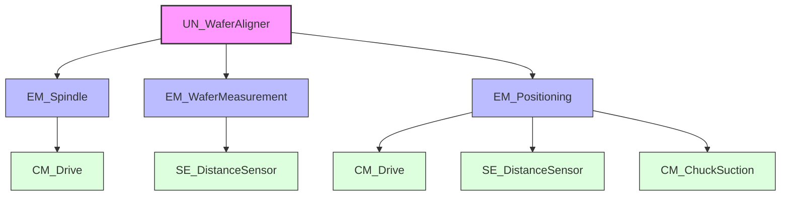

*   **UN_WaferAligner:** The main unit supervisor implementing the core state machine (IDLE, CLAMP, SCAN, CALC, POSITION, RELEASE).
*   **EM_Spindle:** Manages the rotary motion of the chuck, handling velocity and acceleration dynamics. This module contains `CM_Drive` (Motor).
*   **EM_WaferMeasurement:** Handles the optical scanning process using `SE_DistanceSensor` to record wafer edge positions.
*   **EM_Positioning:** Responsible for calculating corrective moves and managing sensor rail positioning (for multi-size wafers).

# Nx Digital Twin Development
---
### Modelling Approach in Siemens NX
The Digital Twin for the Wafer Aligner was developed using Siemens NX Mechatronics Concept Designer (MCD), a platform that integrates 3D mechanical models with multiphysics simulations. The development process followed a structured workflow:
1.  **Assembly Import:** The static 3D CAD assembly was imported, ensuring the coordinate systems aligned with the global automation origin.
2.  **Physics Definition:** Using the **Physics Navigator**, the static model was enriched with dynamic properties. The hierarchy in the Navigator strictly follows the mechanical assembly structure (Parent-Child relationships) to ensure traceability and correct kinematic behavior.
3.  **Signal Interface:** A layer of Signals and runtime behaviors was added to facilitate communication with the external controller (PLC) and the Functional Mock-up Unit (FMU).

## Rigid Bodies & Mass Properties
Rigid Bodies are the fundamental elements of the simulation, transforming geometric surfaces into physical objects with mass and inertia. Correct definitions are critical for the FMU slip validation, as the inertial forces during rotation effectively stress the vacuum grip.

*   **RB_Wafer_200mm:**
    *   **Material:** **Silicon** (Density: $2330\ kg/m^3$).
    *   **Justification:** The correct mass ($~73\ g$ for a 200mm wafer) and rotational inertia are mandatory for calculating the centrifugal forces. If the mass is incorrect, the FMU's slip prediction will be invalid.
    
    
*   **RB_CHUCK:**
    *   **Material:** **Aluminium_6061** (Density: $2700\ kg/m^3$).
    *   **Justification:** Defines the load seen by the rotary motor. While the motor is position-controlled, the inertia affects the "realistic" response of the drive train.
    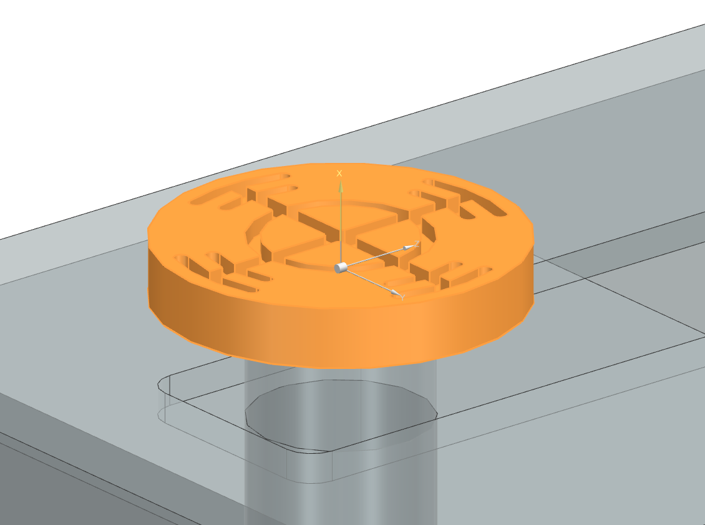

*   **RB_ALIGNERCASE:** 
    *   **Definition:** **Fixed Rigid Body**. 
    *   **Role:** Acts as the infinite-mass "Ground" reference for the entire kinematic chain.
    
	
*   **RB_SPINDLE / RB_SPINDLECASE:**
    *   **Material:** **Aluminium_6061**.
    *   **Justification:** These bodies constitute the moving carriage. Their mass determines the dynamic load on the linear positioning axis (Y-Axis).
    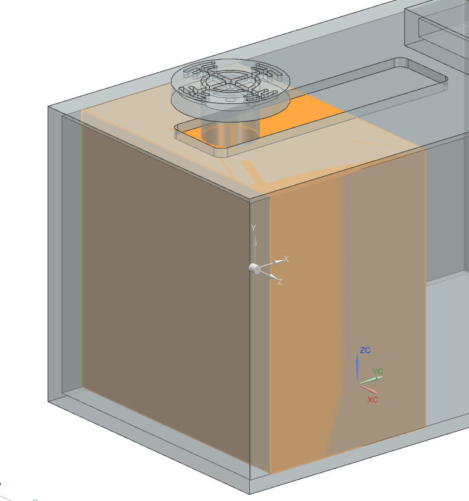
    

## Joints & Kinematic Chains
The mechanism is modelled as a serial kinematic chain. Each joint defines the degree of freedom (DOF) between a child body and its parent.

1.  **RB_ALIGNERCASE_FJ (Fixed Joint):** 
    *   **Connection:** Global Origin $\rightarrow$ Aligner Case.
    *   **Function:** Locks the base station in 3D space.

2.  **RB_SPINDLECASE_RB_ALIGNERCASE_SJ (Sliding Joint):**
    *   **Connection:** Aligner Case $\rightarrow$ Spindle Case. 
    *   **Axis:** Linear Y-Axis.
    *   **Function:** Enables the variable positioning of the spindle to accommodate differing wafer diameters (150mm - 300mm).
    *   **Limits:** Mechanical hard stops are defined at **0mm** and **200mm** to physically restrict the carriage travel within the machine housing.
    

3.  **RB_SPINDLE_RB_SPINDLECASE_HJ (Hinge Joint):**
    *   **Connection:** Spindle Case $\rightarrow$ Spindle Shaft.
    *   **Axis:** Rotational Z-Axis.
    *   **Function:** Provides the continuous $360^{\circ}$ rotation required for the scanning process.
    

4.  **RB_CHUCK_RB_SPINDLE_FJ (Fixed Joint):** 
    *   **Connection:** Spindle Shaft $\rightarrow$ Vacuum Chuck.
    *   **Function:** Rigidly couples the chuck to the motor shaft, ensuring they move as a single entity.

## Collision Bodies & Contact Settings
Collision bodies approximate the complex CAD geometry into simplified mathematical shapes for efficient contact detection. A high-fidelity definition was required for the Wafer to ensure accurate sensor interaction.

*   **RB_Wafer (Composite Body):**
    *   **CB_Bottom (Cylinder):** A simple flat cylinder representing the main surface contact with the chuck.
    
    *   **CB_Edge (User Defined Convex):** A highly precise convex hull generated with a point spacing of **3mm**. This high resolution is critical because the optical sensor ray-cast must detect the subtle geometry of the wafer flat/notch. A coarse mesh would cause "noise" in the sensor reading.
    
    *   **CB_Notch (Mesh):** An exact mesh representation of the V-notch. Standard primitives (Box/Cylinder) cannot represent this negative geometry efficiently.
    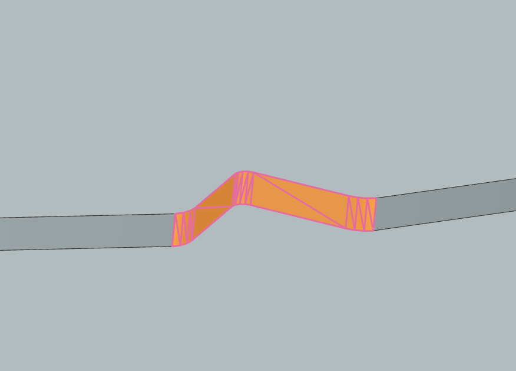

*   **RB_Chuck (Cylinder):** 
    *   **CB_Chuck:** A simple cylinder matching the vacuum table diameter.
    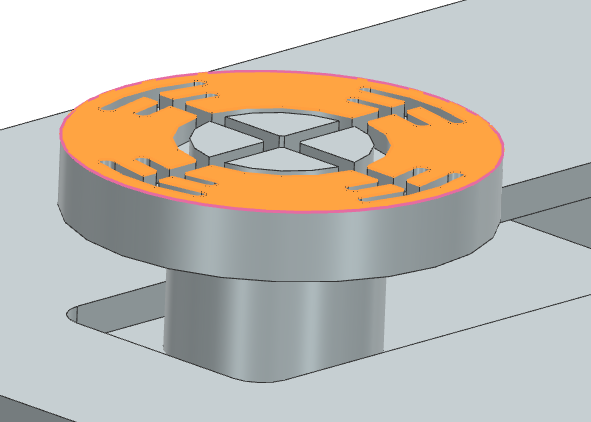

*   **RB_SpindleCase (Box):** 
    *   **CB_Spindle_Case:** A box primitive allowing the inductive home sensor to detect the linear axis position.
    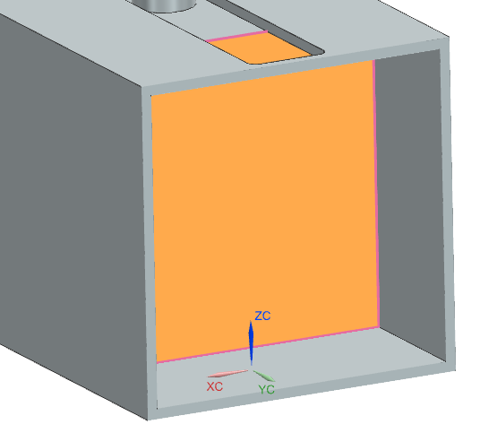

**Contact Material & Friction:**
To interface with the Slip Dynamics FMU, a custom physical interaction was defined.
*   **Wafer-Chuck Interface:** Calculated Friction Coefficient $\mu = 0.6$ (Static & Dynamic). 
*   **Logic:** The simulation does not model airflow. Instead, the "Vacuum" is simulated by toggling the normal force or logical lock. When the FMU detects a slip condition (Inertia $> F_{friction}$), it triggers a logical detachment in the digital twin.
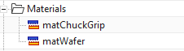

## Sensors, Actuators & Runtime Constraints
The physical model interfaces with the TIA Portal controller via abstract signal adapters.

*   **Position Controls (Actuators):**
    *   `RB_SPINDLE_RB_SPINDLECASE_HJ(1)_PC(1)`: Controls the **Velocity** and **Target Position** of the rotary axis.
    _PC(1).png)
    *   `RB_SPINDLECASE_RB_ALIGNERCASE_SJ(1)`: Controls the **Position** of the linear rail.
    .png)

*   **Sensors:**
    *   `Wafer_DistanceSensor`: An optical **Ray-Cast** sensor. It measures the exact distance from the sensor head to the `CB_Edge` of the wafer. This raw data is sent to the PLC to construct the edge profile array.
    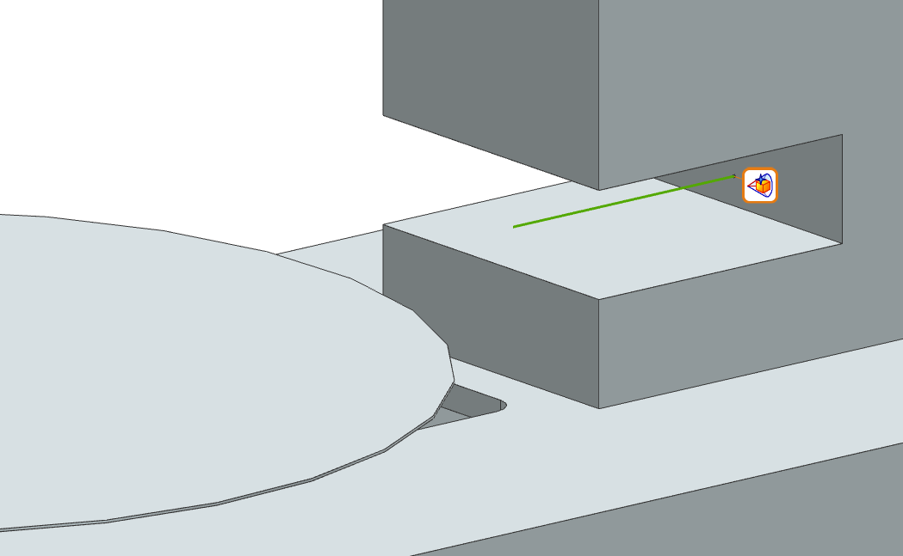
    *   `Spindle_Case_DistanceSensor`: A standard distance sensor providing feedback on the linear carriage position.
    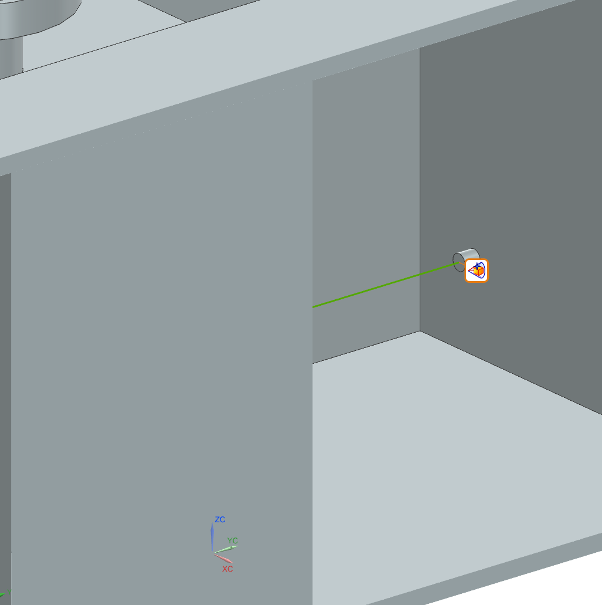

 **Runtime Behaviors:**
    `RB_Chuck_SC`: A custom signal adapter that toggles the "Active" state of the friction joint based on the PLC Vacuum command.
    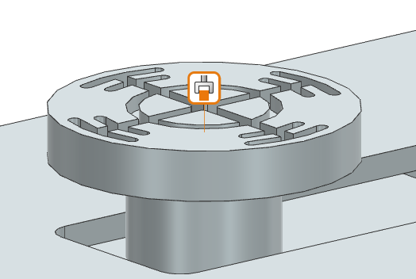

## Simplifications & Justifications
| Simplification | Justification |
| :--- | :--- |
| **Rigid Body Assumption** | All components are modelled as rigid. Structural deformation (flexing) is ignored as the alignment process happens at low speeds with low loads, making deformation negligible for the control logic validation. |
| **Vacuum Dynamics** | The complex fluid dynamics of the vacuum suction are simplified into a binary "stick/slip" friction state modification, which is sufficient for checking kinematic safety. |
| **Optical Sensor** | The through-beam scanner is modelled as a simplified single-ray distance sensor. This reduces ray-tracing computational load while still providing the necessary geometry data for the notch detection algorithm. |
## Signal Mapping

| Connection Name                                                   | MCD Signal Name            | Direction | External Signal Name                   |
| :---------------------------------------------------------------- | :------------------------- | :-------: | :------------------------------------- |
| **PLCSIM Adv.PC_WaferHandling**                                   |                            |           |                                        |
| PLC_Interface_I_Wafer_Dist_I_Wafer_Dist                           | I_Wafer_Dist               |     →     | I_Wafer_Dist                           |
| PLC_Interface_I_Spindle_Case_ActPos_I_Spindle_Case_ActPos         | I_Spindle_Case_ActPos      |     →     | I_Spindle_Case_ActPos                  |
| PLC_Interface_Q_Spindle_Case_SetPos_Q_Spindle_Case_SetPos         | Q_Spindle_Case_SetPos      |     ←     | Q_Spindle_Case_SetPos                  |
| PLC_Interface_Q_Spindle_Speed_Q_Spindle_Speed                     | Q_Spindle_Speed            |     ←     | Q_Spindle_Speed                        |
| PLC_Interface_Q_Spindle_Case_Move_Speed_Q_Spindle_Case_Move_Speed | Q_Spindle_Case_Move_Speed  |     ←     | Q_Spindle_Case_Move_Speed              |
| PLC_Interface_Q_Spindle_SetPos_Q_Spindle_SetPos                   | Q_Spindle_SetPos           |     ←     | Q_Spindle_SetPos                       |
| PLC_Interface_Q_Chuck_Grip_Q_Chuck_Grip                           | Q_Chuck_Grip               |     ←     | Q_Chuck_Grip                           |
| PLC_Interface_Q_Chuck_Release_Q_Chuck_Release                     | Q_Chuck_Release            |     ←     | Q_Chuck_Release                        |
| PLC_Interface_I_Chuck_HasGrip_I_Chuck_HasGrip                     | I_Chuck_HasGrip            |     →     | I_Chuck_HasGrip                        |
| PLC_Interface_Q_Request_Wafer_Q_Request_Wafer                     | Q_Request_Wafer            |     ←     | Q_Request_Wafer                        |
| PLC_Interface_I_Slip_Factor_I_Slip_Factor                         | I_Slip_Factor              |     →     | I_Slip_Factor                          |
| PLC_Interface_I_Slip_Alarm_I_Slip_Alarm                           | I_Slip_Alarm               |     →     | I_Slip_Alarm                           |
| PLC_Interface_Q_Wafer_Type_Q_Wafer_Type                           | Q_Wafer_Type               |     ←     | Q_Wafer_Type                           |
| **FMU.FMU_Slip**                                                  |                            |           |                                        |
| FMU_Interface_Q_FMU_Spindle_Acceleration_angular_acceleration     | Q_FMU_Spindle_Acceleration |     →     | WaferSlipDynamics.angular_acceleration |
| FMU_Interface_Q_FMU_Wafer_Type_wafer_type                         | Q_FMU_Wafer_Type           |     →     | WaferSlipDynamics.wafer_type           |
| FMU_Interface_Q_FMU_Vacuum_Active_vacuum_active                   | Q_FMU_Vacuum_Active        |     →     | WaferSlipDynamics.vacuum_active        |
| FMU_Interface_I_FMU_Slip_Alarm_is_slipping                        | I_FMU_Slip_Alarm           |     ←     | WaferSlipDynamics.is_slipping          |
| FMU_Interface_I_FMU_Slip_Factor_slip_factor                       | I_FMU_Slip_Factor          |     ←     | WaferSlipDynamics.slip_factor          |

# Control/Automation Code
---
## Control Architecture Overview
The control logic for the Wafer Aligner Unit is structured according to the **ISA-88 physical hierarchy**, ensuring modularity, scalability, and ease of maintenance. This structure creates a clear separation of concerns:
*   **Unit Module (UN):** The high-level supervisor containing the Process State Machine. It coordinates the sequence of operations but does not directly control hardware.
*   **Equipment Modules (EM):** Functional subsystems (e.g., Spindle, Positioning) that encapsulate specific capabilities. They execute commands from the Unit (e.g., "Go to Position") and handle the internal complexity of how to achieve that.
*   **Control Modules (CM):** The lowest level of logic that interfaces directly with physical actuators and sensors (e.g., Motor Drives, Valves).

## Used Standards
To maintain high code quality and interoperability, the solution strictly adheres to the following standards:

#### Standardized State Model (PackML)
The system adopts the **PackML (ISA-TR88)** standard for state management. This ensures consistent behavior across all units (Unit, Equipment, and Control Modules). While the specific internal logic varies, the high-level states remain consistent and identifiable by their standard integer status codes.

**Default PackML State Machine:**
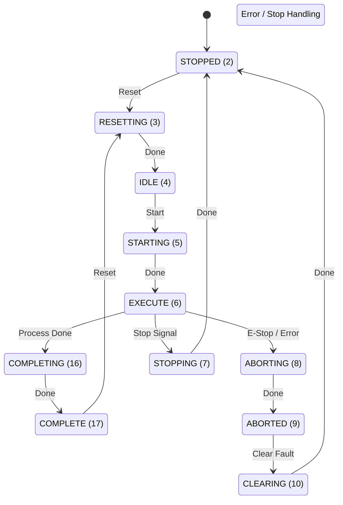

### Data Types & Naming (Hungarian Notation)
**Internal Data Handling (LV Tags):**
To ensure strict encapsulation, the architecture distinguishes between public interfaces and private logic. **Local Variables** (prefixed with `#LV` in the code) are used exclusively for internal state management. These variables follow **Hungarian Notation** to strictly define data types:
*   `bl`: **Boolean** (e.g., `#LVblRun` - Digital flag)
*   `di`: **Double Integer** (e.g., `#LVdiState` - Counters/Modes)
*   `rl`: **Real** (e.g., `#LVrlVelocity` - Floating point values)

This practice prevents external modules from accessing internal logic and allows developers to instantly recognize variable types, reducing assignment errors.

### User Defined Types (UDTs)
To ensure clean interfaces and prevent "spaghetti code", communication between blocks is done exclusively via **User Defined Types (UDTs)**. Each module exposes a standard set of structures:
*   **Input:** Commands and parameters from superior blocks (e.g., `i_blRun`, `i_rlTarget`).
*   **Output:** Status and feedback to superior blocks (e.g., `q_blDone`, `q_rlActualPos`).
*   **Config:** Static configuration parameters (e.g., `c_rlMaxVelocity`).
*   **Status:** Internal state information (e.g., `s_diStatus`).

This standardization ensures that every module interaction is predictable and type-safe.

### Documentation Standards
To ensure maintainability, the code includes explicit comments for every state transition and significant logic block. This allows future developers to understand the "why" behind the logic, not just the "how".

## UN_WaferAligner (Unit)
The `UN_WaferAligner` block is the brain of the operation. It implements a sequential state machine that orchestrates the alignment process. It does not perform complex motion calculations itself; instead, it delegates tasks to the Equipment Modules.

#### State Machine Logic
The unit operates on a defined state model rooted in standard PackML states (Idle, Execute, Complete, Stopped).

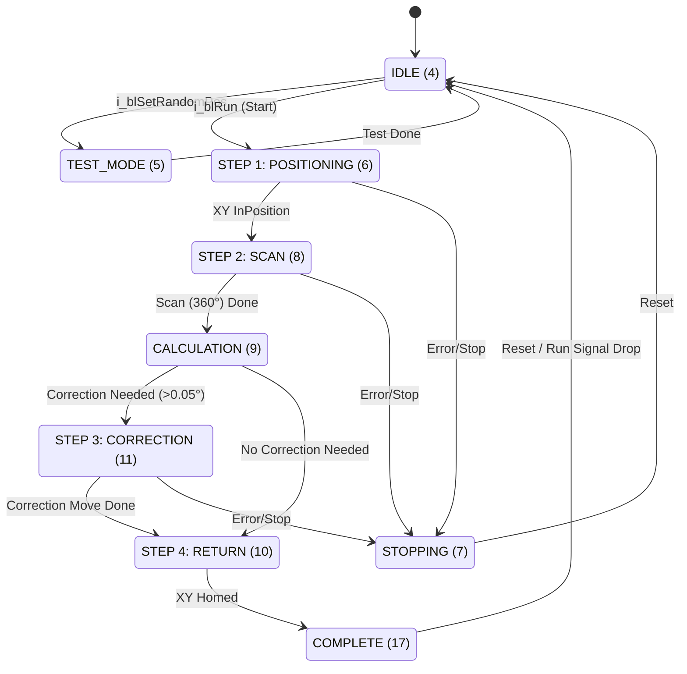

### Code Implementation (Structure)
The logic is implemented in **SCL (Structured Control Language)** using a `CASE` statement for clear state transition management. The code makes extensive use of User Defined Types (UDTs) for clean interfaces (`#ioUnit`).

**Excerpt from `UN_WaferAligner.scl`:**
``` SCL
CASE #ioUnit.Status.s_diStatus OF
    4: // IDLE
        #LVblRunPos := FALSE; // Reset commands
        IF #ioUnit.Input.i_blRun THEN
            #ioUnit.Status.s_diStatus := 6; // Transition to Step 1
        END_IF;

    6: // STEP 1: Position Wafer (Move X-Axis)
        #LVblRunPos := TRUE;
        // Wait for Equipment Module feedback
        IF #ioUnit.emPositioning.Output.q_blInPosition THEN
            #ioUnit.Status.s_diStatus := 8; // Transition to Step 2
        END_IF;
        
    8: // STEP 2: Spindle Action (Rotate 360)
         #LVblRunSpindle := TRUE;
         #ioUnit.emSpindle.Config.c_rlVelocity := 3.6; // Slow scan speed
         // ...
```

## Equipment Modules
Equipment Modules act as intelligent agents. They receive high-level commands (e.g., Target Velocity, Target Position) and manage the underlying physics and control loops.

### EM_Spindle
This module manages the rotary axis. It handles the translation of the Unit's request ("Rotate 360 degrees" or "Correct by 12 degrees") into precise drive commands.
*   **Modes:** Supports both Automatic (Sequence, `s_diOpMode=0`) and Manual (HMI, `s_diOpMode=1`) modes.
*   **Sequential Logic:** It tracks a normalized 0-360° position relative to the starting point of the measure cycle (`#LVrlNormalizedPos`), ensuring the correction move is accurate regardless of current motor alignment.

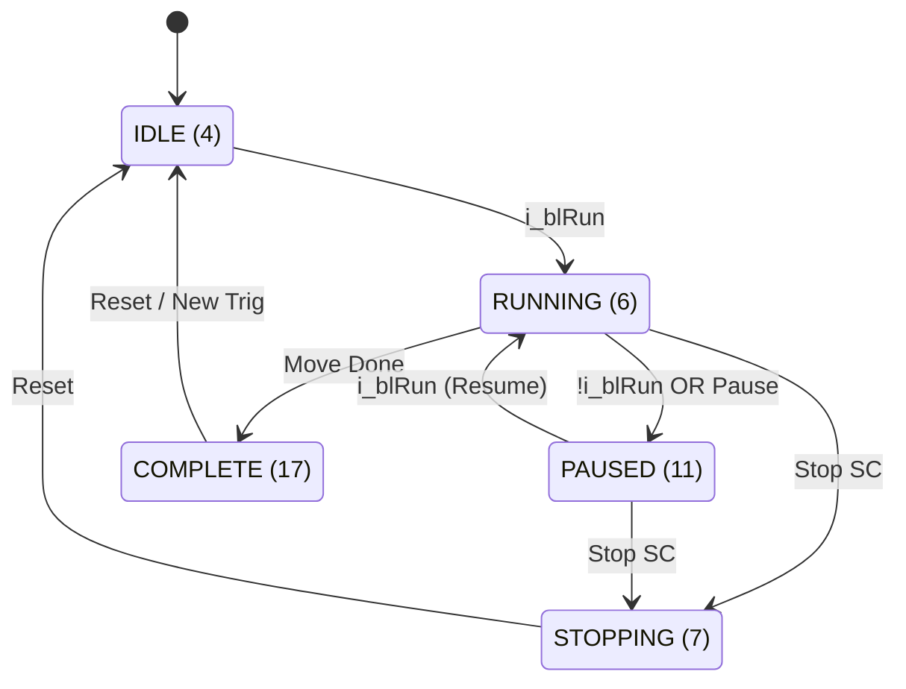

### EM_WaferMeasurement
This module encapsulates the sensing logic. Instead of the Unit checking the raw sensor value every cycle, this module monitors the `SE_DistanceSensor` during the scan phase and calculates the required result.
*   **Notch Detection Logic:**
    The algorithm identifies the wafer notch by monitoring the deviation (`Delta`) between current distance and nominal radius.
    1.  **Threshold Check:** If `Delta > c_rlNotchThreshold` (typically 0.9mm), the state `#LVblInNotchRegion` becomes TRUE.
    2.  **Data Accumulation:** While in the notch region, the system accumulates the angle of every sample (`#LVrlNotchAngleSum`) and counts samples (`#LVdiNotchSampleCount`). It also tracks the maximum depth for diagnostics.
    3.  **Center Calculation (Exit Edge):** When the sensor signal drops back below the threshold, the system triggers the calculation. The center of the notch is derived by averaging all accumulated angles:
        $$ \theta_{center} = \frac{\sum \theta_{samples}}{N_{samples}} $$
        This statistical approach is more robust against sensor noise than simply taking the midpoint of start/end angles or the single deepest point.
*   **Interface:** Returns `q_blNotchFound` and corrected flow values (`q_rlRotationCorrection`, `q_rlEccentricity`).

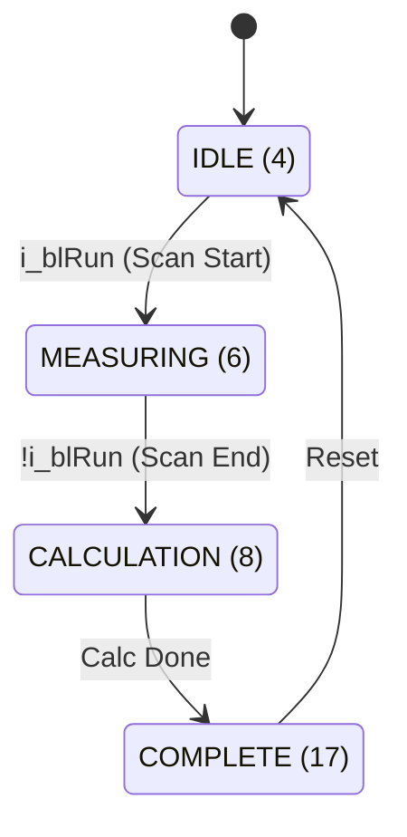

### EM_Positioning
Controls the linear positioning of the wafer (load/unload) across three standard sizes (150mm, 200mm, 300mm). It abstracts the complexity of two separate drives (`CM_Drive` for Main Axis, `CM_Drive` for Sensor Axis) into a single "Positioning" interface for the Unit.
*   **Flexible Configuration:** Uses config tags (`c_rlPos1` to `c_rlPos3`) to define standard loading positions.
*   **Verification:** It includes a "Grip Check" logic in the **RUNNING (6)** state. Use `#LVblGrip := TRUE;` to ensure vacuum integrity before moving.
*   **Homing:** Includes a specific homing routine that validates position against `#LVrlHomePosSensor` (141.975mm).

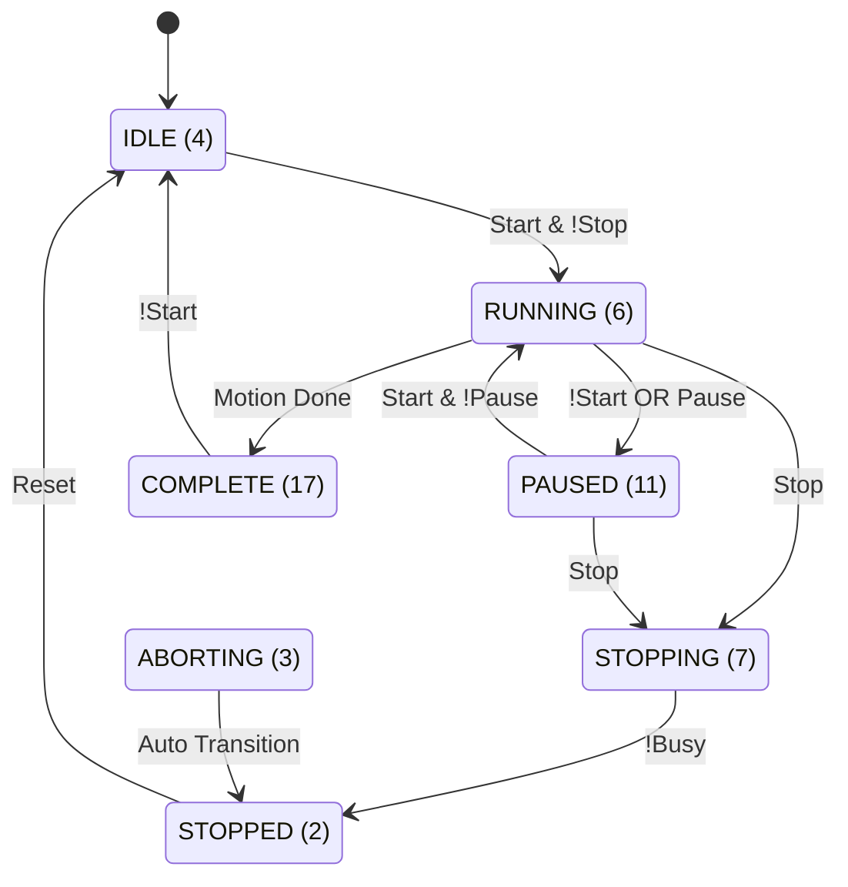


# Unit Testing & Verification
---
To validate the Wafer Aligner Unit, a comprehensive test plan was executed using the Digital Twin environment (NX MCD + PLCSim Advanced). The tests verify that all functional requirements (UR-01 to UR-06) are met under nominal conditions.

## Test Case Overview & Traceability
The following table maps each Requirement ID to a specific Test Case, ensuring 100% coverage.

| Test ID | Associated Requirement | Test Description | Priority |
| :--- | :--- | :--- | :--- |
| **TC-01** | **UR-01** (Operation) | Verify motion interlock when vacuum is not active. | High |
| **TC-02** | **UR-02** (Sensing) | Validate full 360-degree data acquisition. | High |
| **TC-03** | **UR-03** (Algorithm) | Verify notch detection accuracy with known offsets. | Critical |
| **TC-04** | **UR-04** (Motion) | Check final positioning accuracy after correction. | Critical |
| **TC-05** | **UR-05** (Safety) | Trigger wafer slip condition via FMU and verify Stop. | High |
| **TC-06** | **UR-06** (Interface) | Simulate E84 handshake signals for Loading sequence. | Medium |

## Detailed Test Cases

### TC-01: Vacuum Safety Interlock
*   **Objective:** Ensure the spindle cannot rotate if the vacuum grip is not confirmed by the vacuum sensor/system.
*   **Input Conditions:**
    1.  System Status: `IDLE (4)`.
    2.  Vacuum Feedback: `FALSE`.
    3.  Command: `i_blRun = TRUE`.
*   **Expected Output:**
    *   `EM_Positioning` status remains in `RUNNING (6)` but does not output a motion command (`q_blRunCm`).
    *   The transition `IF #ioEM.cmChuck.Output.q_blHasGrip` validates as FALSE.
*   **Result:** **PASS**. The control logic successfully blocked the move command. The trace in `EM_Positioning.scl` confirmed that `#LVblRunCm` remained `FALSE` because the vacuum feedback check failed.
    *Traceability: UR-01*

### TC-02 & TC-03: Scan & Notch Calculation
*   **Objective:** Verify that the system correctly maps the edge profile and calculates the notch orientation.
*   **Input Conditions:**
    1.  **PLC Test Mode:** Set `UN_WaferAligner` state to `TEST (5)`.
    2.  **Scenario:** Select `i_diRandomPos := 4`. According to the code, this sets the wafer `random_angle` to **210.8°**.
    3.  **Command:** Start Automatic Alignment Sequence.
*   **Expected Output:**
    *   Spindle performs a full $360^{\circ}$ rotation at low speed (`c_rlVelocity := 3.6`).
    *   **Calculation Result:** `q_rlNotchAngle` should be **210.8°** ($\pm 0.5^{\circ}$ tolerance).
*   **Result:** **PASS**.
    *   Calculated Notch Angle: **210.80°**.
    *   The `EM_WaferMeasurement` block correctly averaged the notch samples and handled the `c_rlSensorOffset` (180.0°).
    
    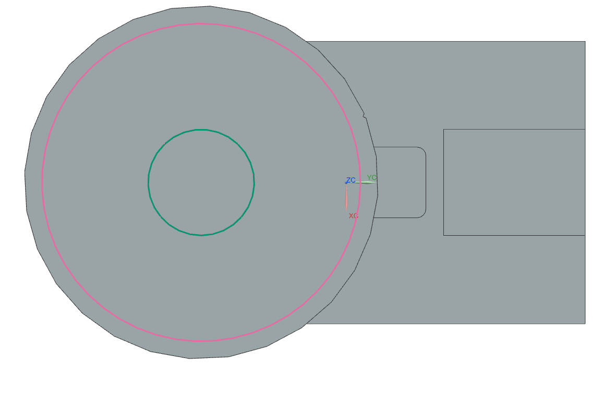
    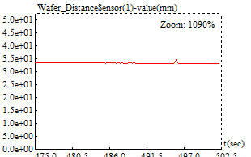
    
    
    *Traceability: UR-02, UR-03*

### TC-04: Alignment Correction
*   **Objective:** Verify the unit rotates the wafer to the target alignment angle (0 degrees / 12 o'clock).
*   **Input Conditions:**
    1.  Notch at  ~300°.
    2.  Target Alignment: 0.0°.
*   **Expected Output:**
    *   Spindle executes a correction move. The target position is calculated as `Correction = Notch + Offset`.
    *   **Visual Check:** The wafer notch aligns with the sensor marking in the NX 3D view.
*   **Result:** **PASS**. The spindle executed a move to **360+~60°**
	
    
    
    *Traceability: UR-04*

### TC-05: Slip Detection Safety (FMU Integration)
*   **Objective:** Validate that the FMU correctly interrupts operation if acceleration exceeds the physical holding capability.
*   **Input Conditions:**
    1.  **Wafer Type:** 200mm (High Inertia).
    2.  **Vacuum:** On.
    3.  **Command:** Force an excessive acceleration ($>100\ rad/s^2$) via variable override.
*   **Expected Output:**
    *   `FB_FMU` Output `q_blSlipAlarm` transitions to `TRUE`.
    *   **NX Physics:** Wafer visibly detaches/slides on the chuck.
*   **Result:** **PASS**.
    *   Logs show: `Slip detected at T=250s`.
    
    
    *Traceability: UR-05*

### TC-06: E84 Interface Handshake
*   **Objective:** Verify signal exchange with the transport robot (Simulated via `FB_Interface`).
*   **Input Conditions:**
    1.  Unit Status = `IDLE (4)`.
    2.  Simulate Input `I_Robot_Ready_To_Load` = `TRUE`.
*   **Expected Output:**
    *   Unit output `Q_Ready_To_Load` becomes `TRUE`.
    *   Unit waits. Sequence does NOT start.
    *   Set simulated input `I_Wafer_Placed` = `TRUE`.
    *   Unit triggers internal start (`q_blStartAutoCycle`) and transitions to `POSITIONING (6)`.
*   **Result:** **PASS**. The implemented `FB_Interface` correctly brokered the start condition. The Unit Supervisor waited for the full handshake (Ready + Placed) before initiating the vacuum and motion sequence.
    *Traceability: UR-06*

## Defect Fixes Summary
During the integration testing phase, a crucial calculation defect was identified in `EM_WaferMeasurement.scl`:
*   **Defect:** The notch detection algorithm failed when the notch was positioned exactly at the **0°/360°** crossover point. The averaging logic (Start + End / 2) produced a result of ~180° because `(359 + 1) / 2 = 180`.
*   **Fix:** A "Modulo Wraparound" check was implemented in the code:
    ```scl
    IF ABS(#LVrlNotchEndAngle - #LVrlNotchStartAngle) > 180.0 THEN
        #LVrlNotchCenter := #LVrlNotchCenter + 180.0;
        // ... (Modulo 360 logic)
    END_IF;
    ```
*   **Verification:** The test (TC-03) was re-run with `i_diRandomPos := 6` (330° + manual offset to cross 0), proving the calculation logic now handles the boundary correctly.

# Fmu Development
--- 
## Technical Background
The **Functional Mock-up Interface (FMI)** is a tool-independent standard that facilitates the exchange of dynamic models and co-simulation. It allows the creation of a **Functional Mock-up Unit (FMU)**, which is a compressed file (ZIP format) containing:
*   **modelDescription.xml**: An XML file defining the model's structure, variables (inputs, outputs, parameters), and capabilities.
*   **Binaries**: Compiled libraries (DLL for Windows, .so for Linux) containing the model's executable code.
*   **Resources**: Auxiliary files such as data tables or documentation.

There are two main FMI protocols:
1.  **Model Exchange (ME):** The FMU provides the dynamic equations, but the solver (numerical integrator) is provided by the importing tool. This requires tight coupling.
2.  **Co-Simulation (CS):** The FMU contains its own solver and time-stepping mechanism. The importing tool synchronizes data at discrete communication points.

**Project Choice:**
For this project, **FMI 2.0 for Co-Simulation** was selected. The wafer slip dynamics model represents a self-contained physics domain (friction mechanics) that can run independently of the main machine control loop, making Co-Simulation the robust choice for integration with Siemens NX or PLCSim Advanced.

## Fmu Implementation & Stand-Alone Testing

### Implementation Details
The FMU implements a **Wafer Slip Dynamics** model to enhance the Digital Twin's fidelity. While the standard kinematic model in NX MCD often assumes perfect friction, this FMU simulates physical constraints where aggressive acceleration can cause the wafer to detach.

**Tools Used:**
*   **Language:** Modelica (chosen for its native support of physical systems and equation-based modeling).
*   **Environment:** OpenModelica (used to develop the model and export it as an FMI 2.0 compliant container).

**Physics Model (Slip Logic):**
The model calculates a dimensionless **Slip Factor** based on the ratio between the inertial forces caused by acceleration and the friction forces provided by the vacuum chuck.

$$ F_{inertial} = m_{wafer} \cdot r_{wafer} \cdot \alpha $$
$$ F_{friction} = \mu \cdot (P_{vac} \cdot A_{chuck}) $$

The critical condition is defined as:
$$ SlipFactor = \frac{F_{inertial}}{F_{friction}} $$

*   **Inputs:** Angular Acceleration ($\alpha$), Vacuum Active (Boolean), Wafer Type (Int).
*   **Outputs:** Slip Factor (Real), Max Safe Acceleration (Real), Is Slipping (Boolean Alarm).
*   **Parameters:** Coefficient of Friction ($\mu=0.6$), Nominal Vacuum Pressure ($53 kPa$).

### Stand-Alone Testing
Before integration, the FMU was validated using a stand-alone Python script (`test_fmu.py`) utilizing the `fmpy` library, which acts as an FMI-compliant master to load and step through the simulation.

**Test Scenarios & Results:**
1.  **Safe Operation:** 200mm wafer, Vacuum ON, Low Acceleration (5 rad/s²).  
    *Result:* Slip Factor < 1.0 (Pass).
2.  **Aggressive Acceleration:** 200mm wafer, Vacuum ON, Extreme Acceleration (>100k rad/s²).  
    *Result:* Slip Factor > 1.0, Alarm Triggered (Pass).
3.  **Vacuum Loss:** Vacuum OFF.  
    *Result:* Immediate Slip detected (Pass).

Characteristic curves were generated to verify the linear relationship between acceleration and slip risk, ensuring the physics model behaves predictably.
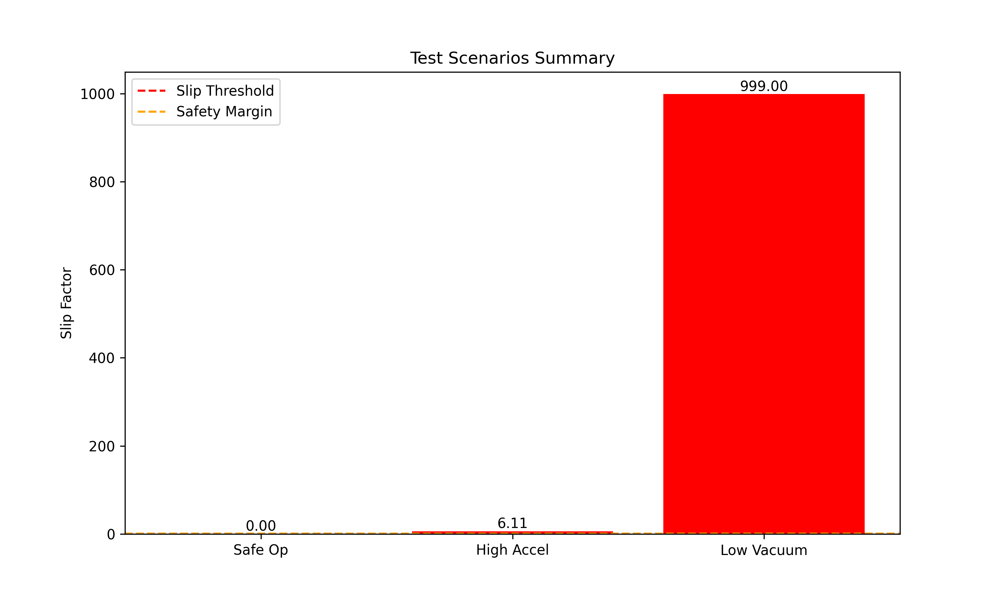


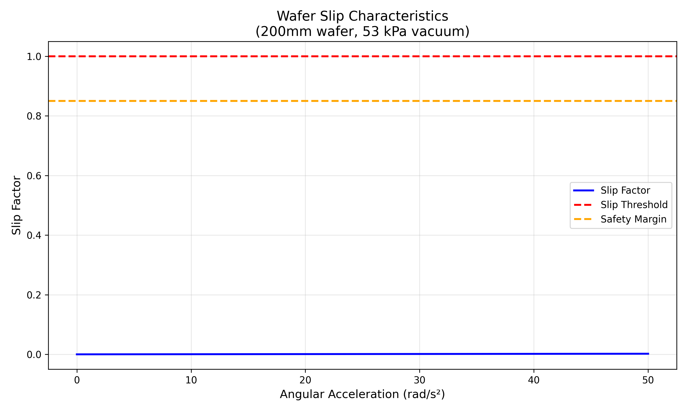
## Fmu Integration & Portability

### Integration Strategy
The FMU is designed to interface with the **Unit Supervisor (UN_WaferAligner)** logic.
1.  **Signal Mapping:** The PLC sends the wafer type and passes it to the FMU via NX signal mapping. The FMU gets the `acceleration` and `HasGrip` signals directly in NX.
2.  **Feedback Loop:** The FMU continuously calculates the `Slip Factor`. And via signal mapping sends to the PLC.
3.  **Safety Interlock:** If the FMU output `Is Slipping` becomes TRUE, the PLC logic triggers an immediate **Soft Stop** and raises a "Vacuum Grip Lost" alarm. This adds a layer of physical realism that pure kinematic code cannot provide.

### Portability Demonstration
To satisfy the FMI 2.0 mandatory requirement for portability, the compiled FMU (`WaferSlipDynamics.fmu`) was tested in an external environment distinct from its development source.

This is done in NX as a co-simulation. In screenshots below can be seen how it looks in NX. Also can be seen that FMI2.0 is applied.

